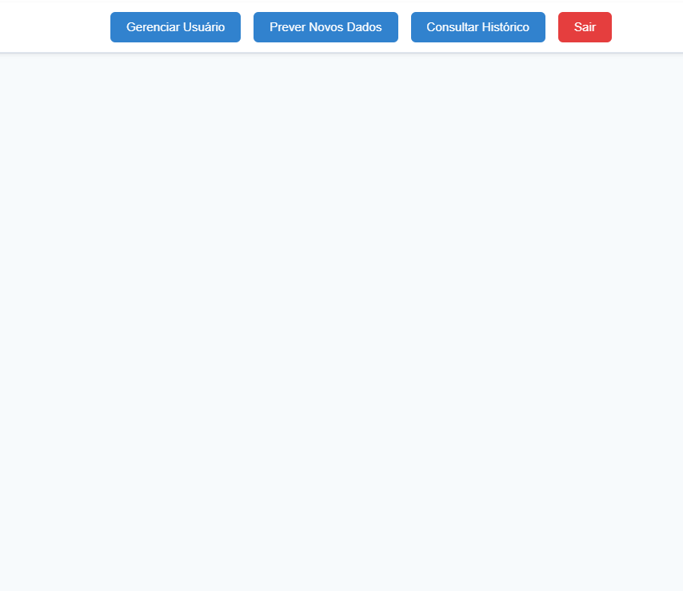
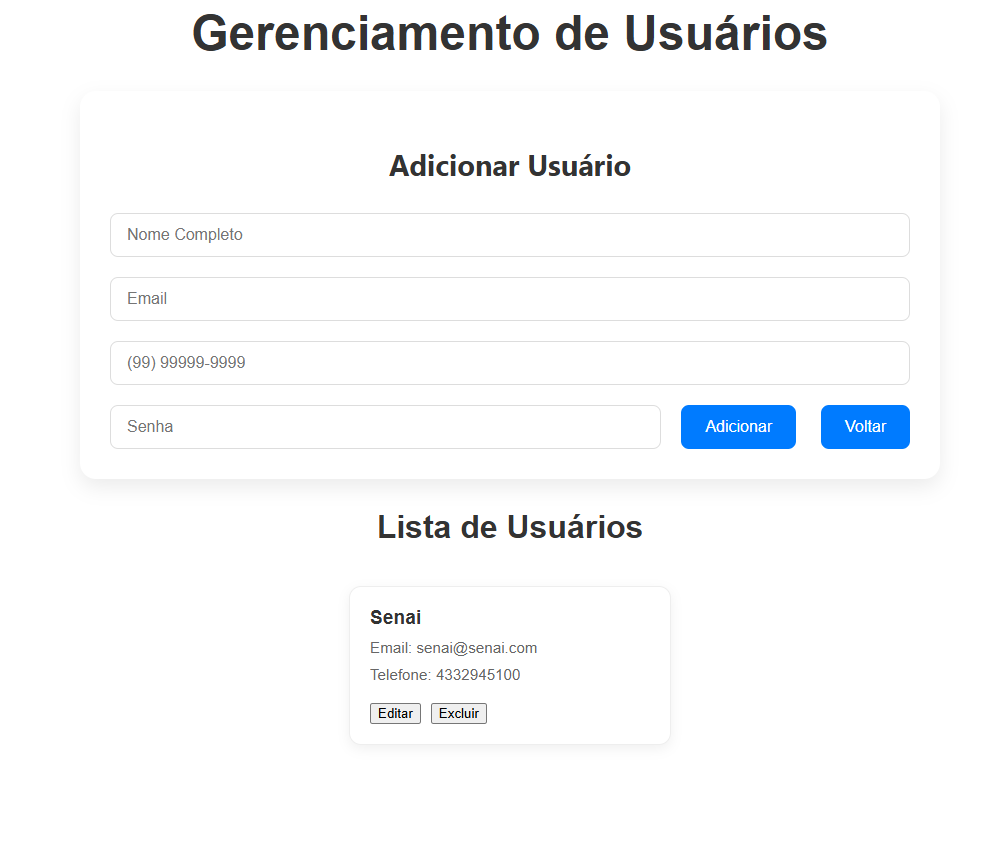
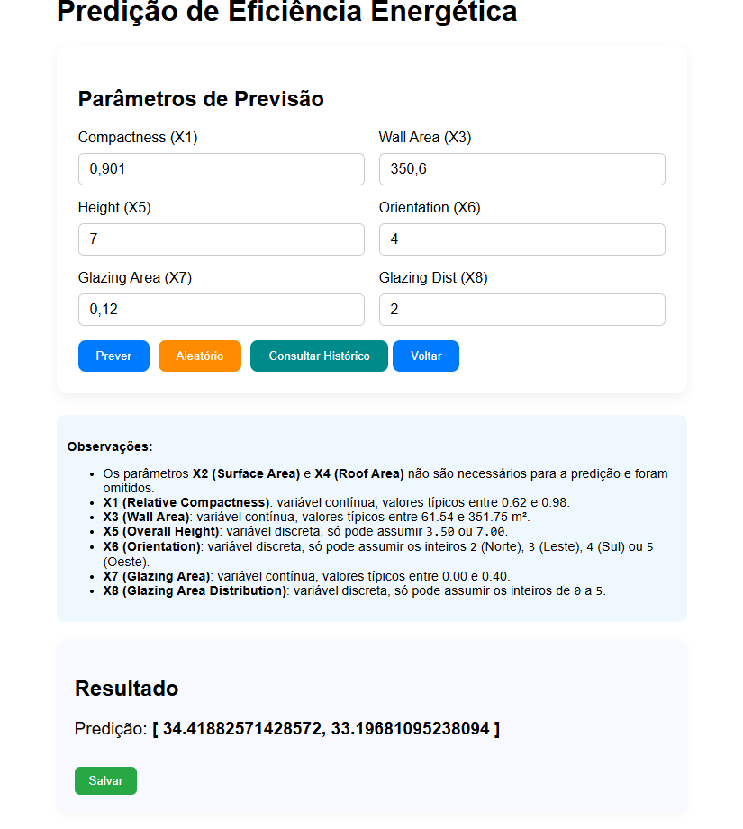
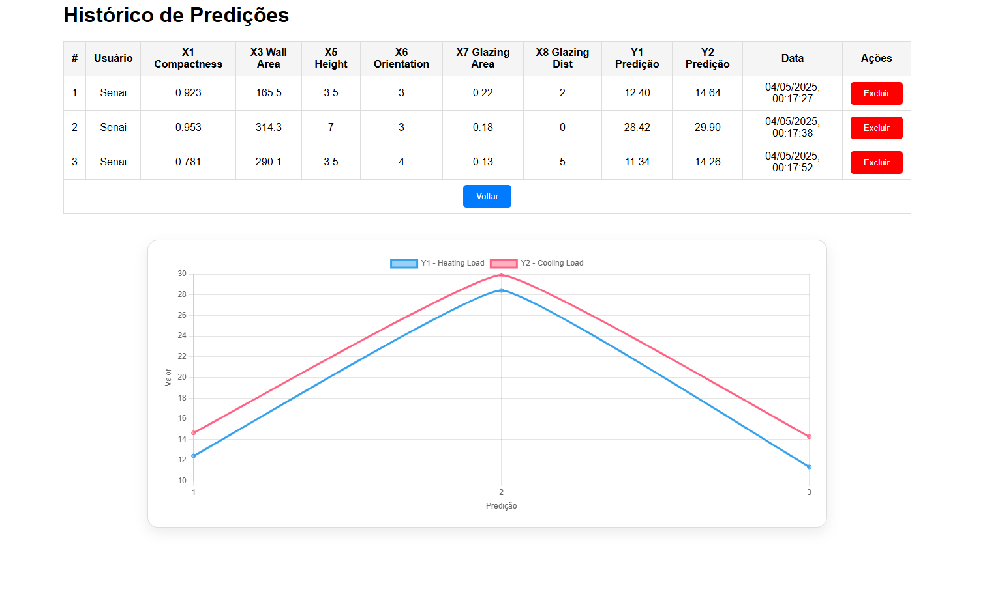

# case-regressão

Case utilizando o dataset Energy Efficiency para a concorrência de bolsas no Senai  
**Gustavo Queiroz Silveira - 05/2025**

---

## Objetivo

O objetivo deste projeto é prever o consumo de energia de um edifício com base em suas características físicas e ambientais. O dataset contém informações sobre a eficiência energética de edifícios, incluindo variáveis como a área do edifício, a temperatura externa, a umidade e outros fatores que podem afetar o consumo de energia.  
O objetivo é construir um modelo de regressão que possa prever o consumo de energia com base nessas variáveis.

---

## Projeto

O projeto está dividido em 3 partes principais:

```
├───AT1 - EDA
├───AT2 - Modelagem
└───AT3 - Desenvolvimento
    ├───backend
    │   ├───api
    │   ├───pred_app
    └───frontend
```

### AT1 - EDA

- **Análise Exploratória de Dados (EDA):**  
  Entender as características do dataset e identificar padrões e tendências nos dados.
- **Limpeza e pré-processamento dos dados:**  
  Tratamento de valores ausentes e normalização das variáveis.
- **Visualização dos dados:**  
  Identificar correlações entre as variáveis e o consumo de energia.

### AT2 - Modelagem

- **Divisão do dataset:**  
  Separação em conjuntos de treinamento e teste.
- **Treinamento de modelos de regressão:**  
  Teste de diferentes modelos (Linear, Random Forest, etc.) para prever o consumo de energia.
- **Avaliação dos modelos:**  
  Uso de métricas como RMSE, MAE e R² para determinar o melhor modelo.
- **Ajuste de hiperparâmetros:**  
  Seleção do melhor modelo e otimização para melhorar o desempenho.

### AT3 - Desenvolvimento

- **API:**  
  Desenvolvimento de uma API para receber os dados de entrada e retornar a previsão do consumo de energia.
- **Frontend:**  
  Aplicativo para permitir que os usuários insiram os dados e visualizem as previsões.
- **Integração:**  
  Conexão entre API e frontend para uma experiência de usuário fluida.
- **Controle de usuários:**  
  Autenticação para garantir acesso apenas a usuários autorizados.
- **Histórico de previsões:**  
  Consulta para visualizar previsões anteriores e comparar resultados.

#### Tecnologias utilizadas:

- **Frontend:** Vue.js  
- **Backend:** Django  
- **Banco de dados:** PostgreSQL  

---

## Instalação e execução do projeto

### Pré-requisitos

- **Git:** ≥ 2.0  
- **Docker:** ≥ 20.10  
- **Docker Compose:** (integrado ao Docker CLI ou plugin, ≥ 1.27)

---

### 1. Clonar o repositório

```bash
git clone https://github.com/gustavo-qs/case-regressao.git
cd case-regressao/AT3-Desenvolvimento/
```

> **Nota:** O arquivo `.env` já está preenchido com as variáveis de ambiente necessárias para o funcionamento do projeto. (Isso não é uma boa prática, mas foi feito para fins de teste técnico.)

---

### 2. Estrutura do `docker-compose.yml`

O Compose já está configurado com 3 serviços:

- **db:** PostgreSQL 15-alpine  
- **backend:** Django + Gunicorn  
- **frontend:** Vue 3 + Vite  

**Portas expostas:**

- **Frontend:** `localhost:5173`  
- **Backend:** `localhost:8000`  
- **Banco:** `localhost:5432`  

---

### 3. Build e execução

No diretório ./AT3-Desenvolvimento, execute o seguinte comando para construir e iniciar os containers:

```bash
docker-compose up --build
```

O Docker irá:

- **Banco:** Inicializar dados e escutar em `0.0.0.0:5432`.  
- **Backend:** Instalar dependências, rodar `migrate`, `collectstatic` e iniciar Gunicorn em `0.0.0.0:8000`.  
- **Frontend:** Instalar dependências e rodar Vite em `0.0.0.0:5173`.  

Aguarde até todos os logs indicarem “ready” ou “Listening at”.

---

### 4. Acessar a aplicação

- **Frontend (UI):**  
  Abra seu navegador em:  
  [http://localhost:5173/](http://localhost:5173/)

- **API (Backend):**  
  Teste no terminal ou Postman:  

```bash
curl http://localhost:8000/
```

---

### 5. Comandos úteis

- **Subir tudo em background:**

```bash
docker-compose up -d
```

- **Parar e remover containers:**

```bash
docker-compose down
```

- **Remover containers, redes e volumes:**

```bash
docker-compose down -v
```

- **Ver logs de um serviço específico:**

```bash
docker-compose logs -f backend
```

## Sistema

- **Home:**  
  Tela inicial com as opções de previsão, histórico e gerenciamento de usuários.


- **Usuário:**  
  Tela de gerenciamento de usuários, onde é possível adicionar, editar ou remover usuários.  
  **Observação:** O usuário padrão é `senai@senai.com` e a senha é `Senai@2025`.


- **Previsões:**  
  Tela de previsões, onde o usuário pode inserir os dados e obter a previsão do consumo de energia.  
  O usuário pode inserir manualmente os dados ou escolher valores aleatórios.
  Clicar em prever e ira mostrar o resultado.
  Se o usuário clicar em "Salvar", a previsão será armazenada no banco de dados e ficará disponível na tela de histórico.
- 

- **Histórico:**  
  Tela de histórico, onde o usuário pode visualizar as previsões anteriores e comparar os resultados.
  O usuário pode excluir previsões do histórico.
